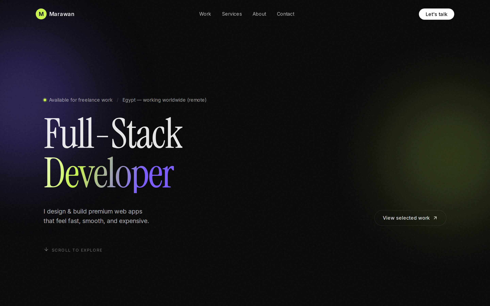
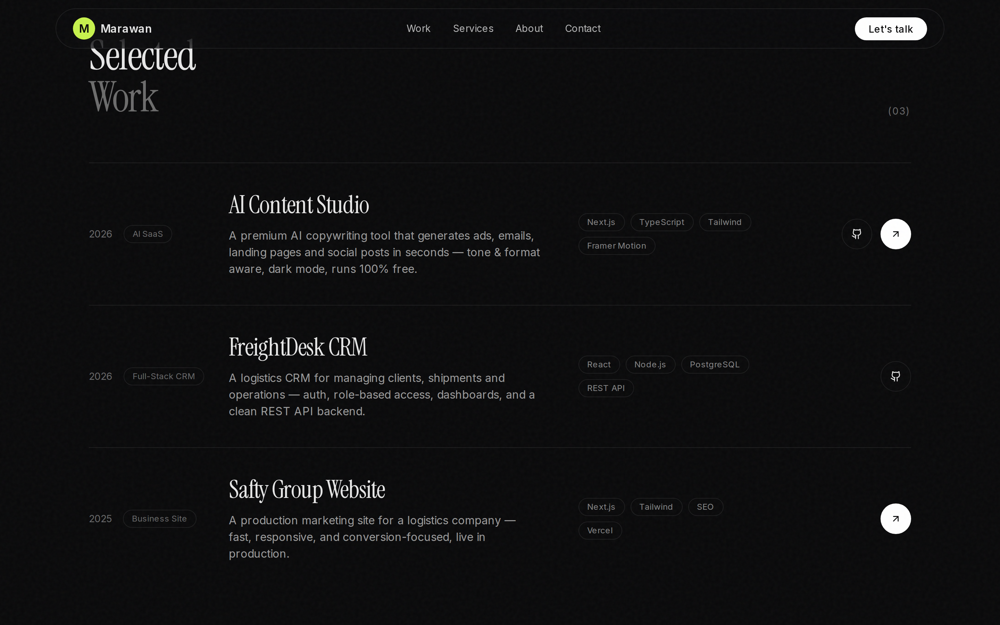
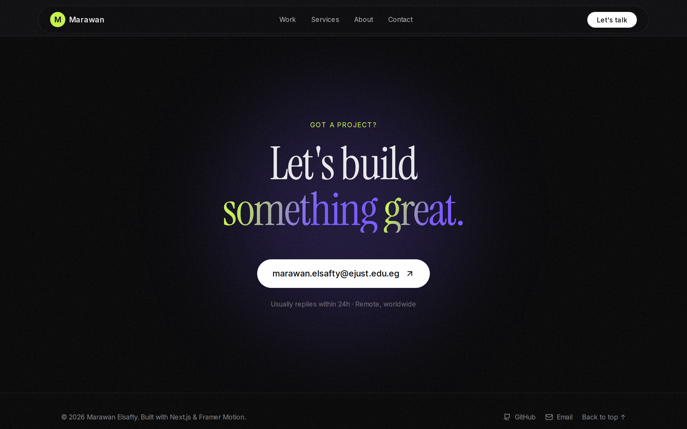

<div align="center">

# Marawan Elsafty — Portfolio

**Premium, animated personal portfolio for a full-stack web developer.**

Built with Next.js 14, TypeScript, Tailwind CSS, and Framer Motion.


</div>

---

## 📸 Preview





## ✨ Highlights

- **Custom motion cursor** with hover-aware scaling
- **Magnetic buttons & links** that respond to the pointer
- **Word-by-word masked headline reveals** on scroll
- **Parallax hero** with ambient gradient glows and film grain
- **Infinite tech-stack marquee**
- **Animated work, services, testimonials, about & contact sections**
- **Animated mobile menu** — hamburger → full-screen overlay
- **Dynamic OG image, favicon, sitemap & robots** generated at the edge (great
  social previews + SEO, no external services)
- Fully **responsive**, **accessible**, and **reduced-motion friendly**
- **Zero backend** — deploys free anywhere, loads instantly

## 🛠️ Tech Stack

| Layer     | Tech                                            |
| --------- | ----------------------------------------------- |
| Framework | [Next.js 14](https://nextjs.org/) (App Router)  |
| Language  | [TypeScript](https://www.typescriptlang.org/)   |
| Styling   | [Tailwind CSS](https://tailwindcss.com/)        |
| Motion    | [Framer Motion](https://www.framer.com/motion/) |
| Icons     | [Lucide](https://lucide.dev/)                   |

## 🏗️ Structure

```
src/
├── app/
│   ├── page.tsx          # Assembles all sections
│   ├── layout.tsx        # Fonts + metadata
│   └── globals.css       # Design tokens, cursor, grain, gradients
├── components/
│   ├── cursor.tsx        # Custom motion cursor
│   ├── magnetic.tsx      # Magnetic hover wrapper
│   ├── reveal.tsx        # Scroll & masked-text reveals
│   ├── nav.tsx
│   └── sections/         # hero, marquee, work, services, about, contact, footer
└── lib/
    └── data.ts           # All content in one editable place
```

## 🧑‍💻 Getting Started

```bash
npm install
npm run dev
```

Open [http://localhost:3000](http://localhost:3000). Edit content in
`src/lib/data.ts` — projects, services, stats, and profile all live there.

## ☁️ Deployment

Push to GitHub and import on [Vercel](https://vercel.com/) — no environment
variables required.

## 📄 License

MIT
