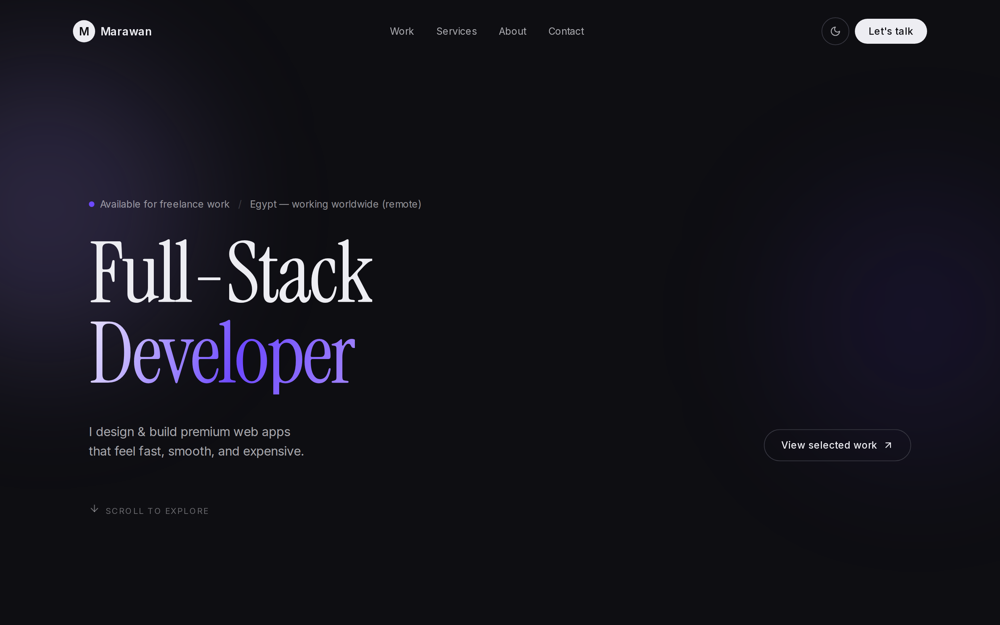
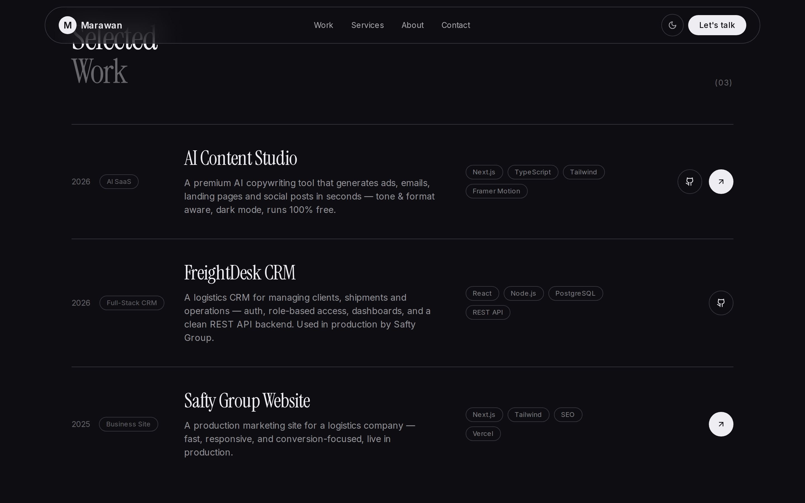

# Marawan Elsafty — Portfolio

My personal portfolio site. I built it to show the kind of work I do — clean,
animated, and fast — and to have one link I can share that points to everything
else.

It has a light and dark theme (starts in dark), some motion touches like
scroll reveals and a mobile menu, and it pulls all its content from a single
file so it's easy to update.

**Live:** https://marawan-portfolio-lemon.vercel.app

## Screenshots




## What's in it

- Animated hero, work, services, about, and contact sections
- Light / dark theme toggle (defaults to dark)
- Responsive with a proper mobile menu
- Social link preview image and basic SEO set up

## Built with

Next.js 14, TypeScript, Tailwind CSS, and Framer Motion. All the text and
project info lives in `src/lib/data.ts`.

## Running it

```bash
npm install
npm run dev
```
